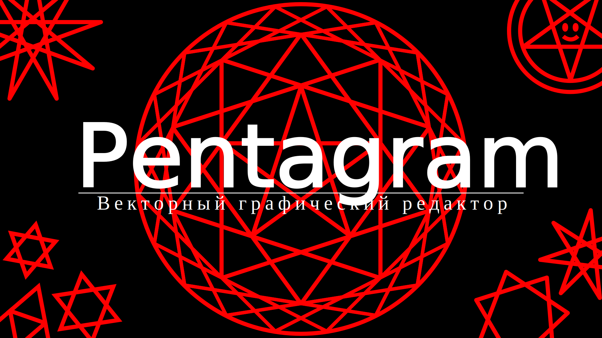

# Редактор svg-файлов

## Функционал

* Общие возможности
  * Создание svg-файла любой ширины/высоты
  * Возможность открыть и редактировать готовый svg-файл.
  * Сохранение файла в формате svg.
  * Сохранение файла в формате png.

* Инструменты
  * Курсор
  > Позволяет выбирать и перетаскивать объекты на холсте.
  * 
  * 

* Параметры
  * 
  * 
  * 

* Дополнительные возможности
  * 
  * 
  * 

* Вид
  * 
  * 
  * 

* Окно "Помощь" с подробными инструкциями

## Разработчики проекта

* Усанов Максим (капитан) - <a href=https://github.com/Mmmaximus> @mmmaximus </a>  
* Терентьева Анна - <a href=https://github.com/mathhyyn> @mathhyyn </a>
* Дельман Александр - <a href=https://github.com/xendalm> @xendalm </a>
* Шевченко Кирилл - <a href=https://github.com/shevchenkokk> @shevchenkokk </a>
* Мещанов Александр - <a href=https://github.com/Meschine> @meschine </a> 
